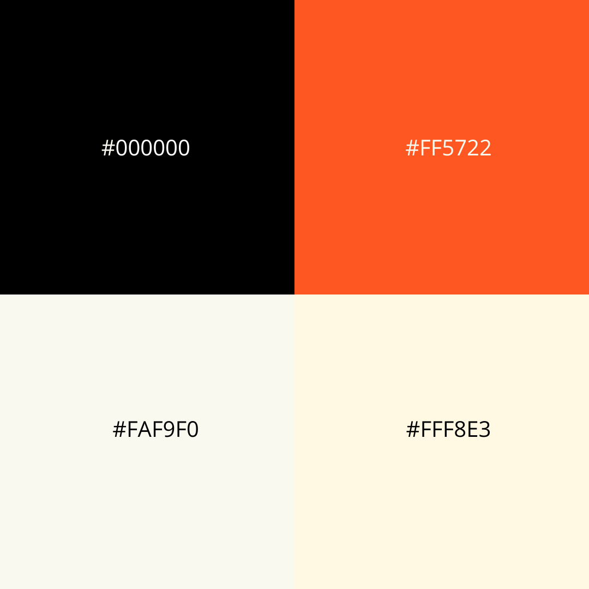

# Tipografía y Paleta de Colores

## Tipografías

### Lobster

Para los títulos, utilizamos la tipografía Lobster. Su estilo friendly y llamativo agrega un toque distintivo a nuestra marca.

### Lato

Para el cuerpo del texto, elegimos la tipografía Lato. Con su sencillez y facilidad de lectura, proporciona una experiencia comprensiva y agradable.

## Paleta de Colores
[]

- **Negro (#000000):** Representa elegancia y contraste.
- **Beige (#FFF8E3):** Aporta calidez y suavidad.
- **Blanco (#FAF9F0):** Proporciona claridad y limpieza.
- **Naranja (#FF5722):** Nuestra tonalidad principal, simbolizando creatividad y entusiasmo.

Estos colores se combinan para transmitir la energía y pasión que queremos darle en el concepto Digital Foodie.