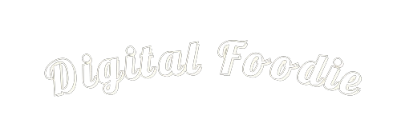

# Digital Foodie

## Descripción de la Oferta

Bienvenido a Digital Foodie, donde fusionamos la pasión por la gastronomía con estrategias digitales innovadoras. Ofrecemos servicios de marketing digital gastronómico que transforman la presencia en línea de restaurantes y negocios culinarios. Desde estrategias en redes sociales hasta desarrollo web especializado, en Digital Foodie, cada plato es una historia digital única.

## Público Objetivo

Nuestros servicios están diseñados para restaurantes, chefs independientes, negocios de catering y cualquier emprendedor gastronómico que busque destacar en el mundo digital. Si buscas llevar tu experiencia culinaria a nuevos horizontes y atraer a una audiencia más amplia, ¡Digital Foodie es para ti!

## Equipo

- **Evely Espinosa - Director de Proyecto y Estrategia Digital:**
Hola, Mi Nombre es Evely Espinosa, Tengo 24 Años, Nací en la Ciudad de Panamá el día 15 de septiembre de 1999, Mi fuerza es mi familia.
Me gradué de Bachiller en Informática, Soy la primera de 3 hermanos, y sigo luchando para tener un título no ha sido fácil, pero con la ayuda de mi familia y de Dios se me a hecho posible las cosas.

- **Aida Lorenzo - Especialista en Redes Sociales y Contenido:** Soy Aida Lorenzo🌸, tengo 21 años y estudio registros médicos. Me caracterizo por ser una persona sencilla, respetuosa y ordenada. Disfruto salir a caminar, apreciar la naturaleza y sumergirme en la lectura.

- **Aldair De Castro - Diseñador y Desarrollador Web:** 
¡Hola! Soy Aldair De Castro, con 29 años, amante de la gastronomía y la tecnología. Con más de 10 años en cocina y 5 años dedicados al marketing digital, fusiono la excelencia culinaria con estrategias digitales vanguardistas. Nací y vivo en Colón, y mi objetivo es ofrecer la mejor experiencia para que tu negocio gastronómico evolucione en el mundo digital. Acompáñame en este viaje donde la pasión por la comida se encuentra con las posibilidades infinitas de la tecnología. ¡Transformemos juntos tu negocio gastronómico!🔥

- **Melliah Samms - Especialista en SEO y Analítica Web:** 
Hola, soy Melliah Samms, con 26 años y originaria de Colón, pero con la mayor parte de mi infancia en Bocas del Toro. Soy la tercera de 4 hermanos y poseo una licenciatura en Administración de Empresas Marítima, un logro del que me siento profundamente orgullosa. Mi dedicación a la educación ha sido un pilar en mi vida académica, y agradezco a mis padres y a Dios por la maravillosa familia y apoyo que tengo. Listos para nuevos desafíos, celebro la unión y la educación que han guiado mi camino. 🌟🌊

## Referencias

Nos inspiramos en estos sitios para nuestro enfoque y estilo:

1.   [Agencia Gastro](https://www.agenciagastro.com)
2.   [La Caballería](https://www.lacaballeria.co)
3.  [Chef Digital](https://chefdigital.es)
4. [My Food Marketing](https://www.myfoodmarketing.com)
5. [Gourmedia](https://gourmedia.es)

Cada una de las páginas representa mucho de lo que queremos implementar en nuestra marca, desde los servicios hasta el estilo que buscamos reflejar en nuestra web.

-----------------------------------------------------------------------------------------------
¡Únete a nosotros en Digital Foodie y transforma tu presencia gastronómica en el mundo digital!

## Tablero

Aqui tiene el link del [Trello](https://trello.com/b/vJDK5hVc/tareas-del-proyecto)